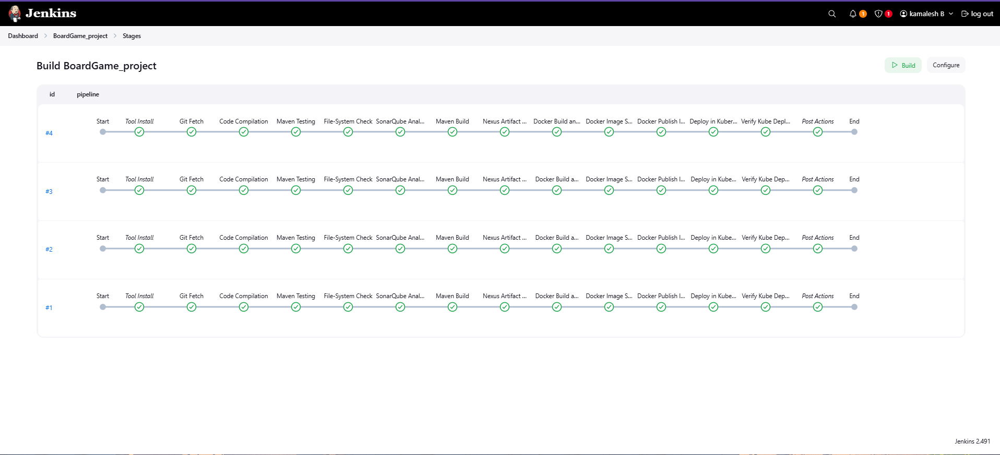
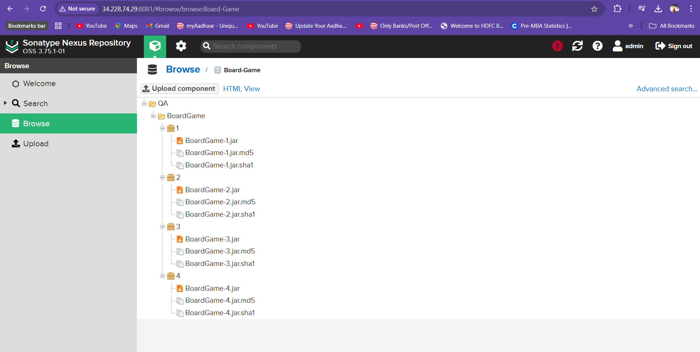
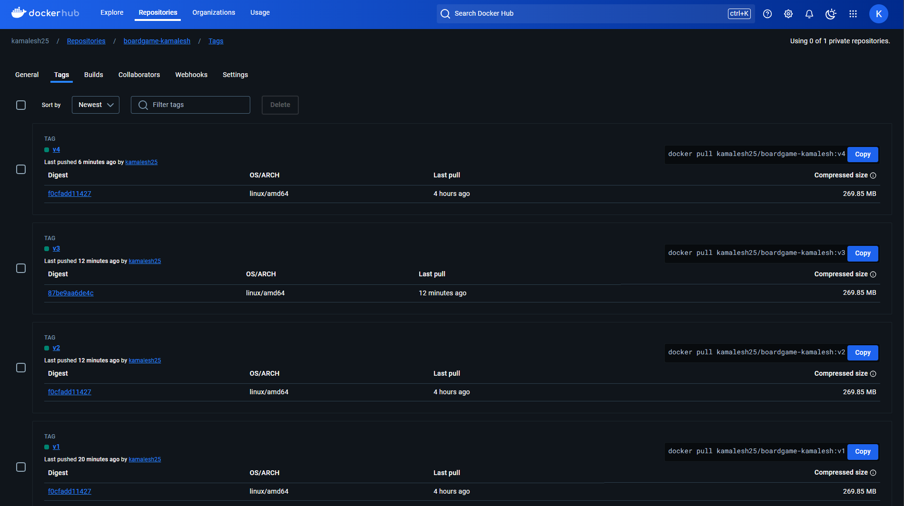
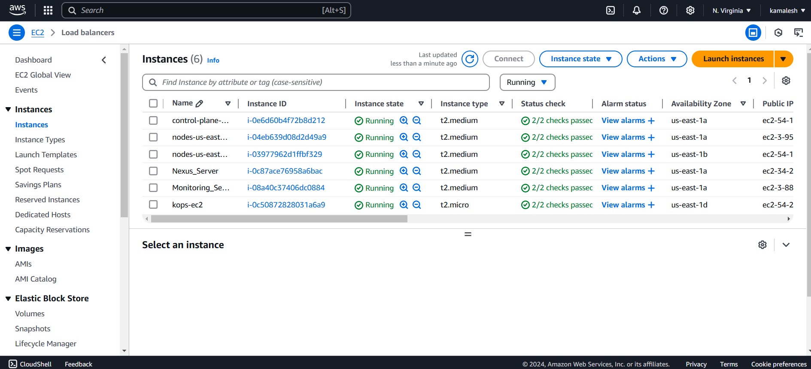
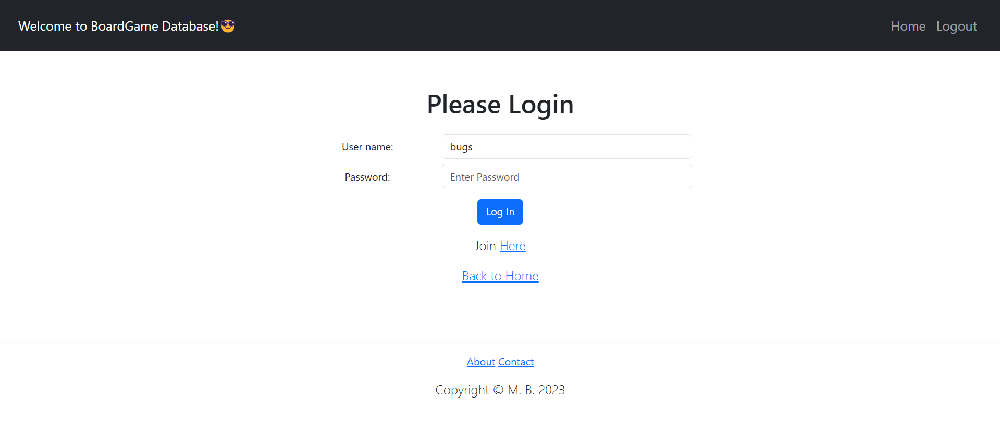
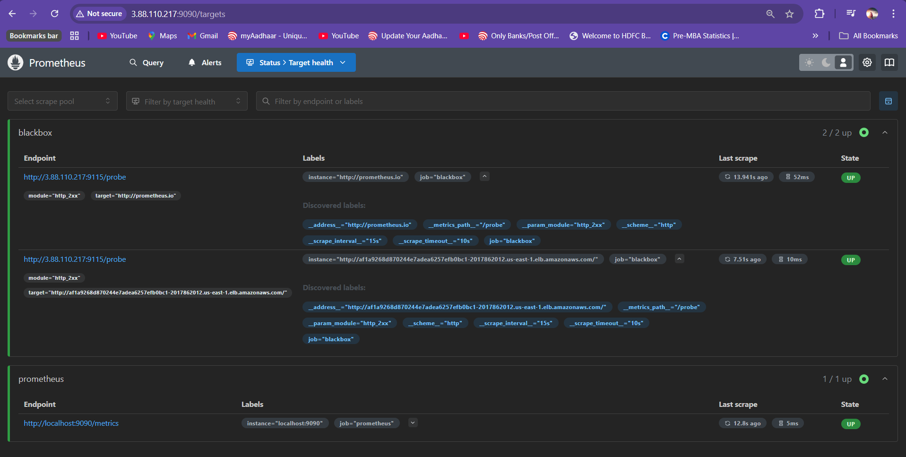
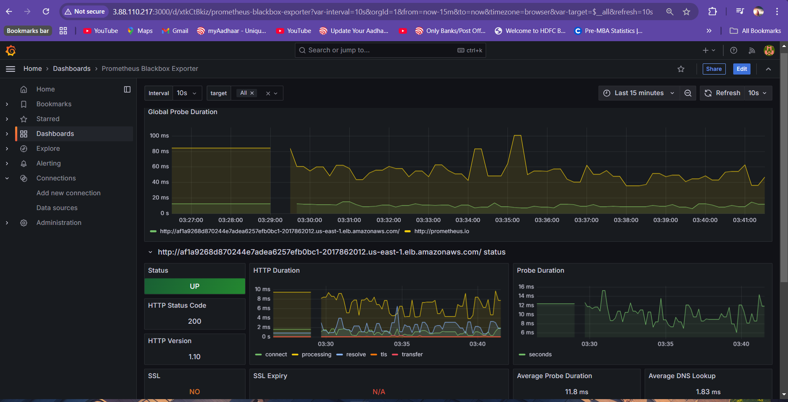
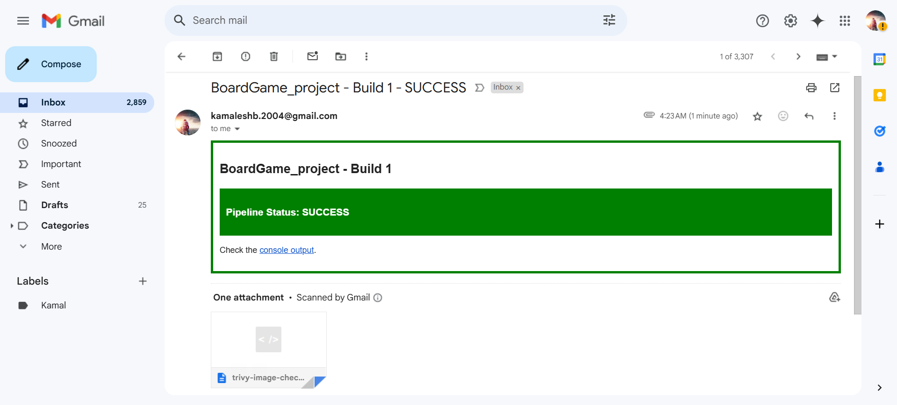

# BoardGame Web Application - DevOps CI/CD Pipeline

## Description

A full-stack Spring Boot web application for managing board games and reviews with role-based access control. This project demonstrates end-to-end DevOps practices including CI/CD automation, containerization, Kubernetes deployment, security scanning, and monitoring.

**Key Capabilities:**
- Users can view, add, and review board games
- Role-based permissions (Non-members, Users, Managers)
- Automated build, test, scan, and deployment pipeline
- Container orchestration with Kubernetes
- Real-time monitoring with Prometheus and Grafana

## Technology Stack

**Application:** Java 17, Spring Boot, Spring Security, Thymeleaf, H2 Database, Maven

**DevOps Tools:** Jenkins, Docker, Kubernetes, SonarQube, Trivy, Nexus, Prometheus, Grafana, Git

**Infrastructure:** AWS EC2

## CI/CD Pipeline Architecture

.png)

### Pipeline Stages

1. **Git Fetch** → Clone source code
2. **Compile & Test** → Maven compile and unit tests
3. **Security Scan** → Trivy filesystem scan
4. **Code Quality** → SonarQube analysis
5. **Build** → Maven package to JAR
6. **Artifact Management** → Upload to Nexus
7. **Containerization** → Docker build and scan
8. **Registry Push** → Push to Docker Hub
9. **Deploy** → Kubernetes deployment
10. **Verify** → Health check pods and services
11. **Notify** → Email build results

### Jenkins Pipeline Execution



### Code Quality Analysis


### Artifact Repository



### Docker Registry



### Kubernetes Deployment



### Application Running



### Monitoring & Alerts

**Prometheus - Metrics Collection**


**Grafana - Visualization Dashboard**


### Build Notifications



## Quick Start

### Local Development

```bash
# Clone and build
git clone https://github.com/25kamalesh/BoardGame.git
cd BoardGame
mvn clean package

# Run application
java -jar target/database_service_project-0.0.7.jar

# Access at http://localhost:8080
# User credentials: bugs/bunny
# Manager credentials: daffy/duck
```

### Docker Deployment

```bash
docker build -t boardgame:latest .
docker run -p 8080:8080 boardgame:latest
```

### Kubernetes Deployment

```bash
kubectl apply -f deployment-service.yaml
kubectl get pods -n webapps
kubectl get svc -n webapps
```

## Project Structure

```
├── src/main/java/com/javaproject/
│   ├── beans/              # Data models
│   ├── controllers/        # MVC controllers
│   ├── database/           # Database layer
│   └── security/           # Security config
├── src/main/resources/
│   ├── templates/          # Thymeleaf views
│   ├── static/             # CSS, JS
│   └── schema.sql
├── Dockerfile              # Container image
├── deployment-service.yaml # K8s manifests
├── JenkinsFIle            # CI/CD pipeline
└── pom.xml                # Maven config
```

## Key Features

**Security:**
- Spring Security with role-based access
- Trivy vulnerability scanning
- SonarQube code analysis

**Automation:**
- Complete CI/CD with Jenkins
- Automated testing and deployment
- Email notifications

**Monitoring:**
- Prometheus for metrics collection
- Grafana dashboards for visualization
- Real-time application monitoring

**Infrastructure:**
- Docker containerization
- Kubernetes orchestration with 2 replicas
- LoadBalancer service for high availability

## Author

**Kamalesh B**
- GitHub: [@25kamalesh](https://github.com/25kamalesh)
- Email: kamaleshb.2004@gmail.com

---

*This project demonstrates production-ready DevOps practices for Java applications.*
